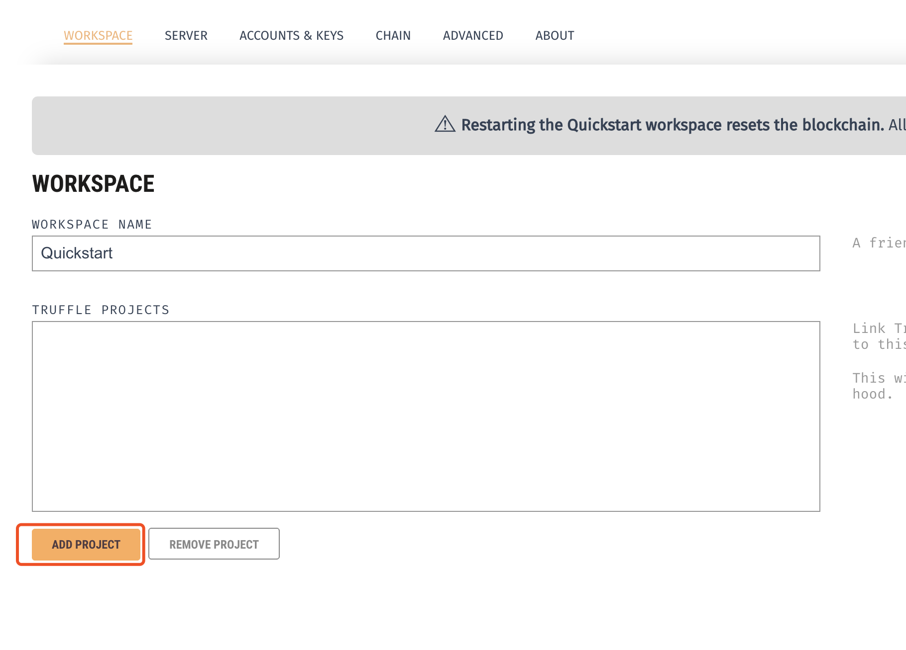
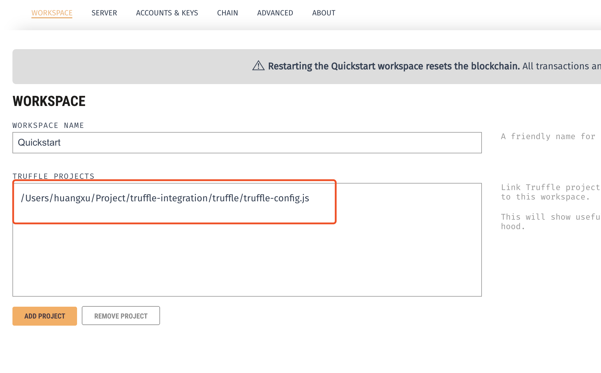
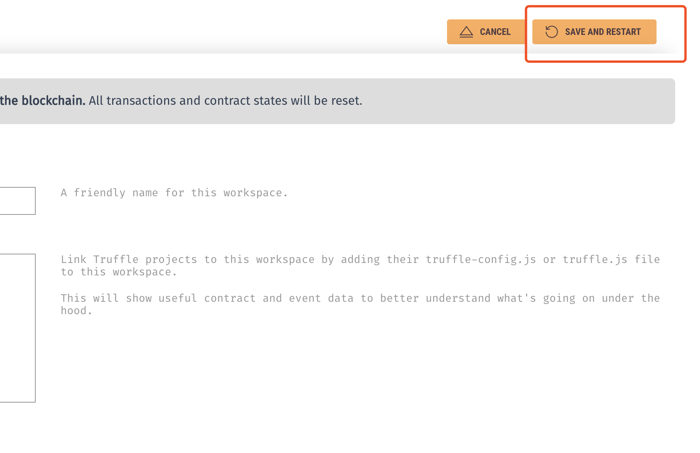

## Step 4 : Compile and Deploy Contracts


Truffle provides a CLI(command line interfafce) for easily compile and eploy contracts into our local blockchains.

#### View Contracts and Transactins in Ganache
If you link this Truffle project to Ganache, you will be able to see the contract creation tx and contract events in the Ganache GUI app.  To link this Truffle project, following this 
1. Enter Ganache setting screen by clicking the gear icon in the upper right corner
1. Click workspace on the top navigation bar and then click on Add Project
1. Pick the truffle-config.js file from <tutorial-root>/truffle/truffle-config.js
1. Save and Restart Ganache






#### Compling Contracts
Change to the root of the truffle directory and then type the following command into a terminal
```shell
cd <tutorial-root>/truffle
truffle compile
```
Upon first run, all contracts will be compiled. Upon subsequent runs, Truffle will compile only the contracts that have been changed since the last compile.

Artifacts of the compilation will be placed in the truffle/build/contracts directory.


#### Running Migrations
Migrations are JavaScript files that help you deploy contracts to the blockchain network. In this tutorial project, we have already created migration scripts in the migrations folder.

The migration script for the EIP20 token contract looks like this:
Filename: 3_deploy_tokens.js
```javascript
const EIP20 = artifacts.require('./EIP20.sol');

module.exports = (deployer) => {
  deployer.deploy(EIP20, 10000, 'Simon Bucks', 1, 'SBX');
};
```
To run the migartions, run the following command into a terminal
```shell
truffle migrate --reset --network regtest
```
Note the --network regtest parameter tells Truffle to deploy this contract into our local RegNet node. 

The migration process may take several minutes depending on the block generation speed. You may want to run it twice to avoid a truffle issue (#2224).